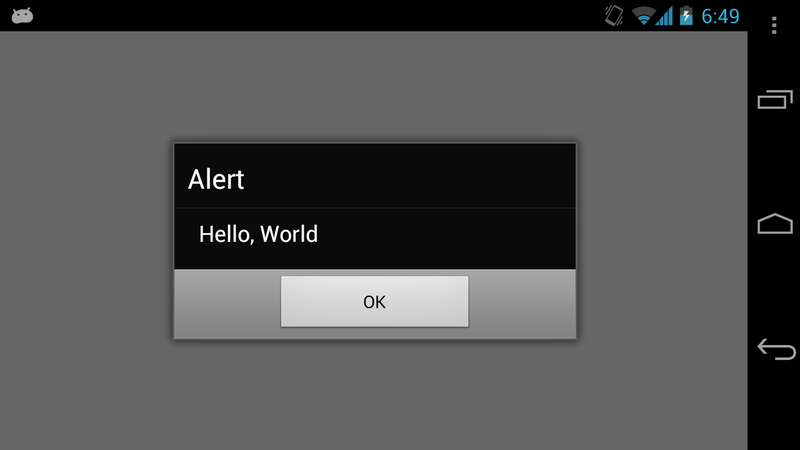

<!SLIDE bullets incremental>

* org.apache.cordova.api.Plugin

<!SLIDE>

	@@@ java
	import org.apache.cordova.api.Plugin
	
	public class Hello extends Plugin {

		public PluginResult execute(
							String action, 
							JSONArray args, 
							String callbackId)
							
<!SLIDE>
.notes PluginResults sends data back to Javascript
PluginResult.Status tells Cordova how to process the result.
Message can be String, JSONArray or JSONObject
PluginResult is how data goes *from* the native code back *to* JavaScript

	@@@ java
	new PluginResult(Status.OK, message);

<!SLIDE>
.notes TODO REMOVE THIS SLIDE

	@@@ java
	new PluginResult(Status.IO_EXCEPTION);

	new PluginResult(Status.NO_RESULT);

<!SLIDE>
.notes Won't compile

    @@@java
	public PluginResult execute(
					String action, 
					JSONArray args, 
					String callbackId) {

        String name = args.getString(0);
        String message = "Hello, " + name;

	    return new PluginResult(
				    Status.OK, message);
    }

<!SLIDE>
.notes args is a JSONArray and throws a JSONException
add a try catch
Note if Cordova gets Status.JSON_EXCEPTION the fail callback is called instead of success

    @@@java
	try {
       	String name = args.getString(0);
       	String message = "Hello, " + name;

		return new PluginResult(
					Status.OK, message);
			
    } catch (JSONException e) {
	
        return new PluginResult(
					Status.JSON_EXCEPTION);
    }

<!SLIDE>
.notes the previous code will work (but omits error and bounds checking)
We are also ignoring the action that was called
For a java plugin, *all* actions go through the one execute method
Plugins typically have multiple actions, so we need to check which action was called
If we get an unexpected action, we return an INVALID_ACTION status which called the fail callback

    @@@java
	public PluginResult execute(
					String action, 
					JSONArray args, 
					String callbackId) {

		if (action.equals("greet")) {
			// ...
		} else if (action.equals("leave")) {
			// ...		
		} else {
	        return new PluginResult(
				Status.INVALID_ACTION);
		}
    }

<!SLIDE>

# config.xml

    @@@xml
	<?xml version="1.0" encoding="utf-8"?>
	<cordova>
		<!-- ... -->
		<plugins>
		  <plugin name="App" 
		    value="org.apache.cordova.App"/>
		  <!-- ... -->
		  <plugin name="Hello" 
		    value="com.example.plugin.Hello"/>
		</plugins>
	</cordova>

<!SLIDE>
.notes implementation is complete
compile and run the code

<!SLIDE>
.notes Thank Fil for example

	@@@ java
	public PluginResult execute(String action, 
	  JSONArray args, String callbackId) {

        this.callbackId = callbackId;
        PluginResult result = 
	      new PluginResult(Status.NO_RESULT);
        result.setKeepCallback(true);
        return result;
	}

<!SLIDE>

	@@@ java
	private void someNativeInvocation() {
		JSONObject data = // ...
		PluginResult result = 
			new PluginResult(Status.OK, data);

	    this.success(result, this.callbackId);
	}
	
<!SLIDE bullets incremental>

